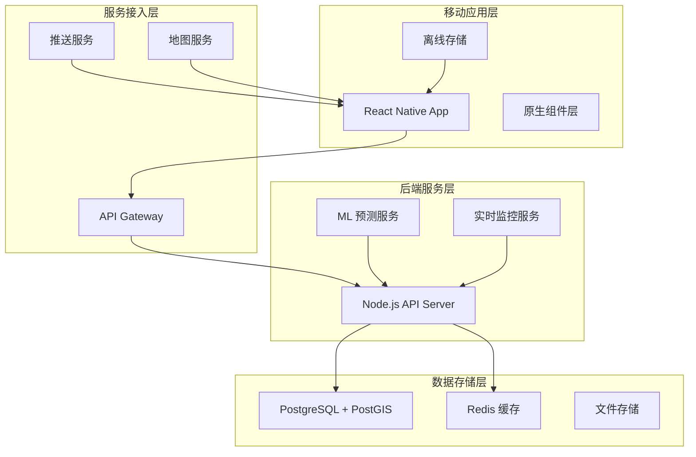
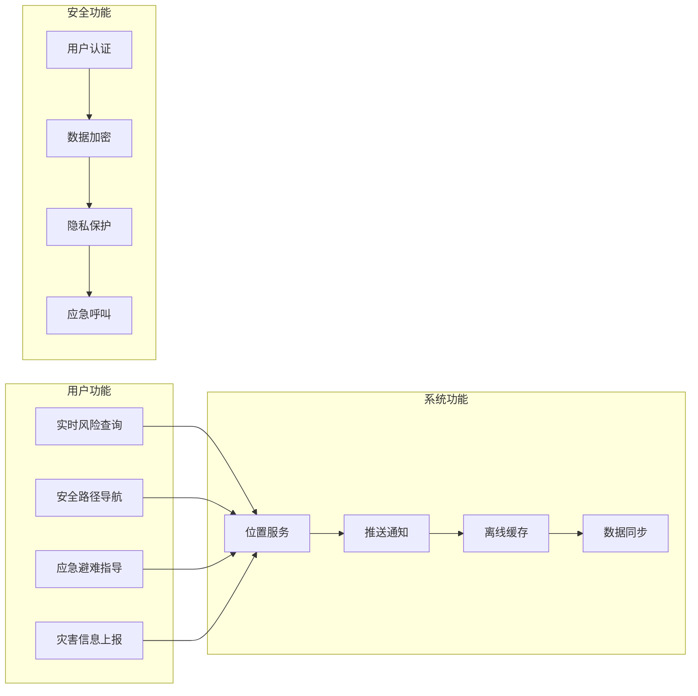
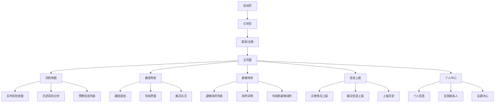
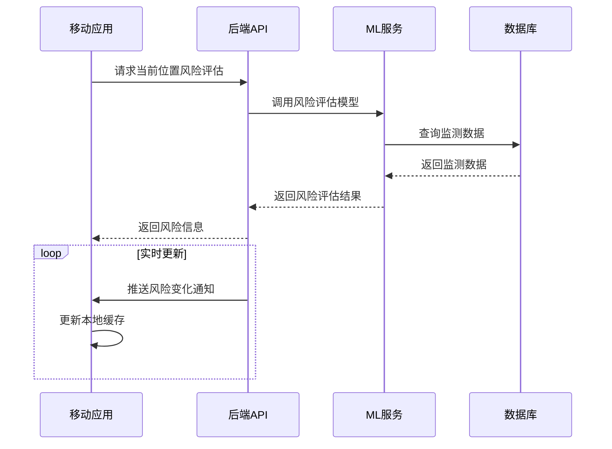
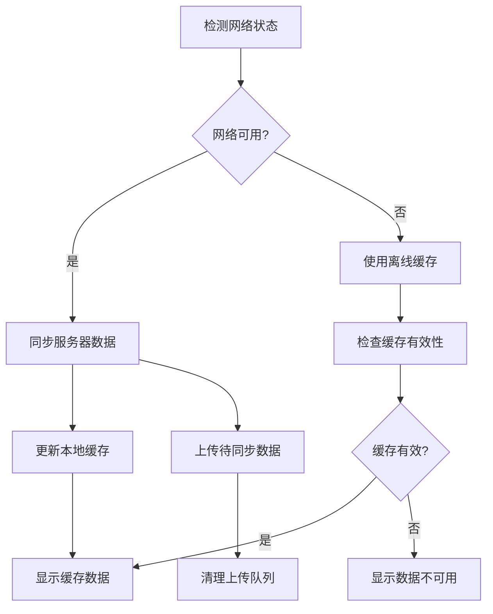
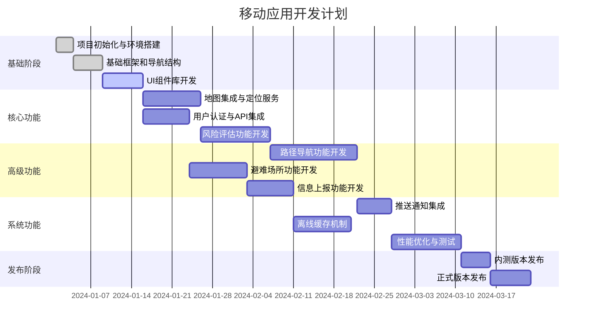
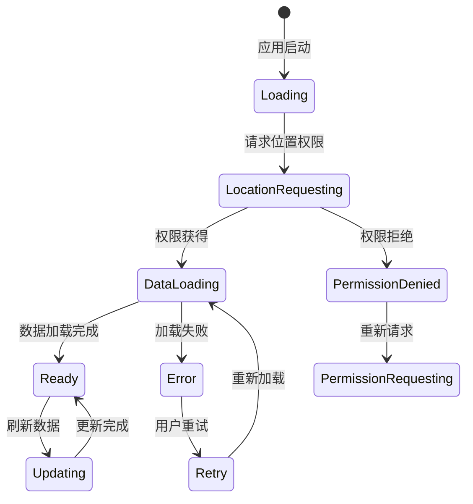

# 地质灾害风险防护移动应用设计文档

## 1. 概述

基于现有的智能化地质灾害风险评估与逃生路径规划系统后端服务，设计一款面向普通用户的移动端应用。该应用将为公众提供实时风险监控、安全导航、应急疏散、灾害上报等核心功能，提升公众防灾减灾意识和应急响应能力。

### 1.1 应用定位
- **目标用户**: 普通公众，特别是灾害易发区域的居民、游客、工作人员
- **核心价值**: 实时风险感知、智能安全导航、快速应急响应
- **应用场景**: 日常出行安全查询、紧急情况逃生导航、灾害信息上报

### 1.2 技术架构


## 2. 技术栈选型

### 2.1 跨平台开发框架
**选择: React Native + TypeScript**

**选型理由:**
- **一致性**: 与现有Web前端技术栈(Vue3 + TypeScript)保持技术生态一致性
- **性能**: 接近原生性能，满足地图渲染和GPS定位等高性能需求
- **开发效率**: 代码复用率高，加快开发迭代速度
- **生态完善**: 丰富的第三方库支持，特别是地图和定位服务
- **团队技能**: 降低学习成本，充分利用现有前端团队技能

### 2.2 状态管理
**选择: Redux Toolkit + RTK Query**

**功能特性:**
- 统一的应用状态管理
- 高效的API数据缓存
- 离线数据同步机制
- 实时数据更新处理

### 2.3 地图服务
**选择: React Native Maps + 高德地图SDK**

**集成方案:**
- 基础地图显示和交互
- 实时位置定位和追踪
- 路径规划和导航功能
- 离线地图数据缓存

### 2.4 推送通知
**选择: React Native Firebase (FCM)**

**推送类型:**
- 风险预警通知
- 应急疏散指令
- 路径变更提醒
- 系统状态更新

### 2.5 离线存储
**选择: AsyncStorage + SQLite**

**存储策略:**
- 用户配置和偏好设置
- 关键地图和路径数据
- 历史记录和缓存数据
- 离线上报数据队列

## 3. 功能架构

### 3.1 核心功能模块



### 3.2 页面层级结构



## 4. 核心界面设计

### 4.1 主界面 - 风险地图
**设计要点:**
- 基于用户当前位置的动态地图视图
- 分层显示风险区域、监测站点、避难场所
- 实时风险等级色彩编码(绿、黄、橙、红、紫)
- 快速功能入口(导航、上报、避难场所)

**关键组件:**
```typescript
interface RiskMapState {
  userLocation: LatLng;
  riskZones: RiskZone[];
  warningLevels: WarningLevel[];
  shelters: Shelter[];
  mapRegion: Region;
  selectedZone?: RiskZone;
}
```

### 4.2 路径导航界面
**设计要点:**
- 起点/终点选择器
- 安全等级优先的路径规划
- 实时路况和风险信息叠加
- 语音导航和震动提醒

**导航参数:**
```typescript
interface NavigationOptions {
  optimizeFor: 'safety' | 'time' | 'distance';
  avoidHighRisk: boolean;
  maxRiskLevel: number;
  alternativeRoutes: boolean;
}
```

### 4.3 避难场所界面
**设计要点:**
- 基于距离和容量的场所推荐
- 实时容量和设施信息显示
- 一键导航和联系功能
- 场所评价和分享功能

### 4.4 信息上报界面
**设计要点:**
- 简化的分类上报流程
- 位置自动获取和确认
- 多媒体附件支持
- 上报状态跟踪

## 5. 数据流设计

### 5.1 实时数据流


### 5.2 离线数据同步


## 6. API接口设计

### 6.1 用户相关接口
基于现有后端API进行适配：

```typescript
// 用户认证
POST /api/v1/auth/login
POST /api/v1/auth/register
POST /api/v1/auth/refresh-token

// 用户信息
GET /api/v1/users/profile
PUT /api/v1/users/profile
POST /api/v1/users/location
```

### 6.2 风险评估接口
```typescript
// 位置风险查询
GET /api/v1/risk-zones/location?longitude={lng}&latitude={lat}
GET /api/v1/risk-zones/{id}/assessments

// 预警信息
GET /api/v1/warnings?status=active
GET /api/v1/warnings/location
```

### 6.3 导航相关接口
```typescript
// 避难场所
GET /api/v1/shelters/nearby?longitude={lng}&latitude={lat}&radius={km}
GET /api/v1/shelters/{id}

// 逃生路径
POST /api/v1/escape-routes/calculate
GET /api/v1/escape-routes/{id}
```

### 6.4 数据上报接口
```typescript
// 用户上报
POST /api/v1/reports
GET /api/v1/reports/my
PUT /api/v1/reports/{id}
```

## 7. 安全与隐私

### 7.1 数据安全
- **传输安全**: HTTPS + SSL证书，API请求加密
- **存储安全**: 本地敏感数据AES-256加密
- **访问控制**: JWT Token认证，权限分级管理

### 7.2 隐私保护
- **位置隐私**: 位置数据匿名化处理，用户授权获取
- **数据最小化**: 仅收集必要的功能数据
- **透明度**: 清晰的隐私政策和数据使用说明

### 7.3 应急安全
- **紧急呼叫**: 一键SOS功能，自动拨打应急电话
- **位置共享**: 紧急状态下向指定联系人发送位置
- **离线可用**: 关键功能离线可用，确保紧急情况下的可访问性

## 8. 性能优化

### 8.1 渲染性能
- **地图优化**: 分级加载，视口内渲染，聚合显示
- **图片优化**: WebP格式，尺寸适配，懒加载
- **动画优化**: 原生动画驱动，减少主线程阻塞

### 8.2 网络性能
- **请求优化**: 接口合并，分页加载，数据压缩
- **缓存策略**: HTTP缓存，本地缓存，智能预加载
- **离线支持**: 关键数据离线缓存，增量同步

### 8.3 电池优化
- **定位优化**: 智能定位频率，后台定位限制
- **后台任务**: 最小化后台活动，合理使用后台权限
- **推送优化**: 精准推送，避免频繁唤醒

## 9. 测试策略

### 9.1 单元测试
- **组件测试**: Jest + React Native Testing Library
- **工具函数**: 纯函数逻辑测试
- **API层**: Mock数据测试

### 9.2 集成测试
- **API集成**: 真实API环境测试
- **导航功能**: 路径规划算法测试
- **数据同步**: 离线在线切换测试

### 9.3 设备测试
- **多设备适配**: iOS/Android主流设备测试
- **性能测试**: 低端设备性能验证
- **网络环境**: 弱网络环境下的稳定性测试

## 10. 部署与运维

### 10.1 应用分发
- **iOS**: App Store发布，企业版分发
- **Android**: Google Play + 国内应用商店
- **更新策略**: 增量更新，热更新支持

### 10.2 监控告警
- **崩溃监控**: Bugsnag/Sentry集成
- **性能监控**: 应用性能和用户行为分析
- **业务监控**: 关键功能使用情况统计

### 10.3 用户反馈
- **意见反馈**: 应用内反馈机制
- **应用商店**: 用户评价监控和回复
- **用户调研**: 定期用户满意度调查

## 11. 开发计划

### 11.1 项目里程碑



### 11.2 技术实施优先级

**第一阶段 - MVP功能 (4周)**
1. 基础应用框架和导航
2. 地图显示和当前位置获取
3. 基础风险信息查询
4. 用户注册登录
5. 简单的预警信息显示

**第二阶段 - 核心功能 (6周)**
1. 完整的风险评估功能
2. 路径规划和导航
3. 避难场所查询和导航
4. 信息上报功能
5. 推送通知系统

**第三阶段 - 优化完善 (4周)**
1. 离线功能支持
2. 性能优化
3. 用户体验优化
4. 测试和bug修复
5. 上线准备

## 12. 技术实施细节

### 12.1 项目初始化

```bash
# 创建React Native项目
npx react-native init DisasterRiskApp --template react-native-template-typescript

# 安装核心依赖
npm install @reduxjs/toolkit react-redux
npm install react-native-maps
npm install @react-native-async-storage/async-storage
npm install react-native-push-notification
npm install react-native-permissions
npm install react-native-geolocation-service
npm install react-native-vector-icons
```

### 12.2 核心配置文件

**app.config.js**
```typescript
export const API_CONFIG = {
  BASE_URL: __DEV__ ? 'http://localhost:3000/api/v1' : 'https://api.disaster-risk.com/api/v1',
  TIMEOUT: 10000,
  RETRY_ATTEMPTS: 3
};

export const MAP_CONFIG = {
  INITIAL_REGION: {
    latitude: 30.2741,
    longitude: 120.1551,
    latitudeDelta: 0.0922,
    longitudeDelta: 0.0421,
  },
  LOCATION_ACCURACY: 'high',
  UPDATE_INTERVAL: 5000
};

export const RISK_LEVELS = {
  1: { color: '#00FF00', label: '很低' },
  2: { color: '#FFFF00', label: '较低' },
  3: { color: '#FFA500', label: '中等' },
  4: { color: '#FF0000', label: '较高' },
  5: { color: '#800080', label: '很高' }
};
```

### 12.3 状态管理架构

```typescript
// store/index.ts
import { configureStore } from '@reduxjs/toolkit';
import authSlice from './slices/authSlice';
import mapSlice from './slices/mapSlice';
import riskSlice from './slices/riskSlice';
import navigationSlice from './slices/navigationSlice';

export const store = configureStore({
  reducer: {
    auth: authSlice,
    map: mapSlice,
    risk: riskSlice,
    navigation: navigationSlice,
  },
  middleware: (getDefaultMiddleware) =>
    getDefaultMiddleware({
      serializableCheck: {
        ignoredActions: ['persist/PERSIST'],
      },
    }),
});

// store/slices/riskSlice.ts
import { createSlice, createAsyncThunk } from '@reduxjs/toolkit';

interface RiskState {
  currentRisk: RiskLevel | null;
  riskZones: RiskZone[];
  activeWarnings: Warning[];
  loading: boolean;
  error: string | null;
}

export const fetchCurrentRisk = createAsyncThunk(
  'risk/fetchCurrent',
  async (location: LatLng) => {
    const response = await api.getRiskByLocation(location);
    return response.data;
  }
);
```

### 12.4 地图组件实现

```typescript
// components/RiskMap.tsx
import React, { useEffect, useState } from 'react';
import MapView, { Marker, Polygon } from 'react-native-maps';
import { useSelector, useDispatch } from 'react-redux';

const RiskMap: React.FC = () => {
  const dispatch = useDispatch();
  const { userLocation, riskZones } = useSelector(state => state.map);
  const { currentRisk } = useSelector(state => state.risk);

  const renderRiskZones = () => {
    return riskZones.map(zone => (
      <Polygon
        key={zone.id}
        coordinates={zone.geometry.coordinates[0]}
        fillColor={RISK_LEVELS[zone.base_risk_level].color}
        strokeColor="#000"
        strokeWidth={1}
        fillOpacity={0.3}
        onPress={() => handleZonePress(zone)}
      />
    ));
  };

  return (
    <MapView
      style={styles.map}
      initialRegion={MAP_CONFIG.INITIAL_REGION}
      showsUserLocation
      showsMyLocationButton
      onRegionChangeComplete={handleRegionChange}
    >
      {userLocation && (
        <Marker
          coordinate={userLocation}
          title="我的位置"
          description={`当前风险等级: ${currentRisk?.level || '未知'}`}
        />
      )}
      {renderRiskZones()}
    </MapView>
  );
};
```

### 12.5 API服务层

```typescript
// services/api.ts
import axios from 'axios';
import { API_CONFIG } from '../config/app.config';

class ApiService {
  private api = axios.create({
    baseURL: API_CONFIG.BASE_URL,
    timeout: API_CONFIG.TIMEOUT,
  });

  constructor() {
    this.setupInterceptors();
  }

  private setupInterceptors() {
    this.api.interceptors.request.use(
      (config) => {
        const token = getStoredToken();
        if (token) {
          config.headers.Authorization = `Bearer ${token}`;
        }
        return config;
      },
      (error) => Promise.reject(error)
    );
  }

  // 风险评估相关
  async getRiskByLocation(location: LatLng) {
    return this.api.get('/risk-zones/location', {
      params: {
        longitude: location.longitude,
        latitude: location.latitude
      }
    });
  }

  // 路径规划相关
  async calculateEscapeRoute(start: LatLng, end: LatLng, options: NavigationOptions) {
    return this.api.post('/escape-routes/calculate', {
      start_point: start,
      end_point: end,
      ...options
    });
  }

  // 避难场所相关
  async getNearbyStroubles(location: LatLng, radius: number = 10) {
    return this.api.get('/shelters/nearby', {
      params: {
        longitude: location.longitude,
        latitude: location.latitude,
        radius
      }
    });
  }
}

export const apiService = new ApiService();
```

## 13. 关键功能实现方案

### 13.1 实时风险监控

```typescript
// hooks/useRiskMonitoring.ts
import { useEffect } from 'react';
import { useDispatch, useSelector } from 'react-redux';
import { fetchCurrentRisk } from '../store/slices/riskSlice';

export const useRiskMonitoring = () => {
  const dispatch = useDispatch();
  const { userLocation } = useSelector(state => state.map);
  const { currentRisk } = useSelector(state => state.risk);

  useEffect(() => {
    if (userLocation) {
      // 初始获取风险信息
      dispatch(fetchCurrentRisk(userLocation));

      // 设置定时更新
      const interval = setInterval(() => {
        dispatch(fetchCurrentRisk(userLocation));
      }, 30000); // 30秒更新一次

      return () => clearInterval(interval);
    }
  }, [userLocation, dispatch]);

  return { currentRisk };
};
```

### 13.2 智能推送通知

```typescript
// services/pushNotification.ts
import PushNotification from 'react-native-push-notification';

class PushNotificationService {
  configure() {
    PushNotification.configure({
      onNotification: (notification) => {
        if (notification.data.type === 'risk_warning') {
          this.handleRiskWarning(notification.data);
        }
      },
      requestPermissions: Platform.OS === 'ios',
    });
  }

  scheduleRiskWarning(riskLevel: number, location: string) {
    const message = this.getRiskMessage(riskLevel);
    
    PushNotification.localNotification({
      title: '风险预警',
      message: `${location}: ${message}`,
      playSound: riskLevel >= 4,
      vibrate: riskLevel >= 3,
      priority: riskLevel >= 4 ? 'high' : 'default',
    });
  }

  private getRiskMessage(level: number): string {
    const messages = {
      1: '风险等级较低，请注意安全',
      2: '风险等级上升，请保持警惕',
      3: '中等风险，建议避开该区域',
      4: '高风险区域，请立即离开',
      5: '极高风险，紧急疏散！'
    };
    return messages[level] || '未知风险等级';
  }
}
```

### 13.3 离线数据管理

```typescript
// services/offlineManager.ts
import AsyncStorage from '@react-native-async-storage/async-storage';
import SQLite from 'react-native-sqlite-storage';

class OfflineDataManager {
  private db: SQLite.SQLiteDatabase;

  async initialize() {
    this.db = await SQLite.openDatabase({
      name: 'DisasterRiskApp.db',
      location: 'default'
    });
    
    await this.createTables();
  }

  private async createTables() {
    const queries = [
      `CREATE TABLE IF NOT EXISTS risk_zones (
        id INTEGER PRIMARY KEY,
        name TEXT,
        risk_level INTEGER,
        geometry TEXT,
        updated_at TEXT
      )`,
      `CREATE TABLE IF NOT EXISTS shelters (
        id INTEGER PRIMARY KEY,
        name TEXT,
        location TEXT,
        capacity INTEGER,
        updated_at TEXT
      )`
    ];

    for (const query of queries) {
      await this.db.executeSql(query);
    }
  }

  async cacheRiskZones(zones: RiskZone[]) {
    const query = `INSERT OR REPLACE INTO risk_zones 
                   (id, name, risk_level, geometry, updated_at) 
                   VALUES (?, ?, ?, ?, ?)`;
    
    for (const zone of zones) {
      await this.db.executeSql(query, [
        zone.id,
        zone.name,
        zone.base_risk_level,
        JSON.stringify(zone.geometry),
        new Date().toISOString()
      ]);
    }
  }

  async getCachedRiskZones(): Promise<RiskZone[]> {
    const [results] = await this.db.executeSql(
      'SELECT * FROM risk_zones ORDER BY updated_at DESC'
    );
    
    return Array.from({ length: results.rows.length }, (_, i) => {
      const row = results.rows.item(i);
      return {
        ...row,
        geometry: JSON.parse(row.geometry)
      };
    });
  }
}
```

## 14. 用户体验优化

### 14.1 加载状态管理


### 14.2 错误处理策略
- **网络错误**: 自动重试 + 离线模式提示
- **定位失败**: 手动选择位置 + 默认区域
- **API错误**: 友好错误提示 + 反馈渠道
- **应用崩溃**: 自动恢复 + 错误上报

### 14.3 无障碍访问
- **语音提示**: 关键操作的语音反馈
- **字体缩放**: 支持系统字体大小设置
- **高对比度**: 色盲用户友好的颜色方案
- **触摸优化**: 大尺寸触摸目标，减少误操作

## 15. 运营数据分析

### 15.1 关键指标监控
- **功能使用率**: 各核心功能的使用频次
- **用户留存**: 日活、周活、月活用户数据
- **性能指标**: 应用启动时间、API响应时间
- **错误率**: 崩溃率、API失败率

### 15.2 用户行为分析
- **路径分析**: 用户操作路径和流失点
- **地理分布**: 用户地理位置分布热力图
- **时间分析**: 用户活跃时间段分析
- **功能偏好**: 不同用户群体的功能偏好

## 16. 完整项目实现代码

### 16.1 项目初始化和配置

#### 创建项目命令
```bash
npx react-native init DisasterRiskApp --template react-native-template-typescript
cd DisasterRiskApp

# 安装核心依赖
npm install @reduxjs/toolkit react-redux redux-persist
npm install @react-navigation/native @react-navigation/stack @react-navigation/bottom-tabs
npm install react-native-maps react-native-geolocation-service
npm install react-native-permissions @react-native-async-storage/async-storage
npm install react-native-push-notification react-native-vector-icons
npm install axios react-native-image-picker react-native-sqlite-storage

# iOS特殊配置
cd ios && pod install && cd ..
```

#### 核心配置文件

**tsconfig.json**
```json
{
  "extends": "@tsconfig/react-native/tsconfig.json",
  "compilerOptions": {
    "baseUrl": "./src",
    "paths": {
      "@/*": ["*"],
      "@components/*": ["components/*"],
      "@screens/*": ["screens/*"],
      "@services/*": ["services/*"],
      "@store/*": ["store/*"]
    }
  }
}
```

**src/config/app.config.ts**
```typescript
export const API_CONFIG = {
  BASE_URL: __DEV__ ? 'http://192.168.1.100:3000/api/v1' : 'https://api.disaster-risk.com/api/v1',
  TIMEOUT: 10000
};

export const MAP_CONFIG = {
  INITIAL_REGION: {
    latitude: 30.2741,
    longitude: 120.1551,
    latitudeDelta: 0.0922,
    longitudeDelta: 0.0421,
  }
};

export const RISK_LEVELS = {
  1: { color: '#00FF00', label: '很低' },
  2: { color: '#FFFF00', label: '较低' },
  3: { color: '#FFA500', label: '中等' },
  4: { color: '#FF0000', label: '较高' },
  5: { color: '#800080', label: '很高' }
};
```

### 16.2 类型定义

**src/types/index.ts**
```typescript
export interface LatLng {
  latitude: number;
  longitude: number;
}

export interface RiskZone {
  id: number;
  name: string;
  geometry: any;
  base_risk_level: number;
  disaster_type_id: number;
}

export interface Shelter {
  id: number;
  name: string;
  location: { latitude: number; longitude: number };
  capacity: number;
  current_occupancy: number;
  safety_level: number;
}

export interface Warning {
  id: number;
  title: string;
  content: string;
  warning_level: number;
  status: 'active' | 'cancelled';
  issue_time: string;
}
```

### 16.3 Redux Store配置

**src/store/index.ts**
```typescript
import { configureStore } from '@reduxjs/toolkit';
import { persistStore, persistReducer } from 'redux-persist';
import AsyncStorage from '@react-native-async-storage/async-storage';
import { combineReducers } from '@reduxjs/toolkit';

import authSlice from './slices/authSlice';
import mapSlice from './slices/mapSlice';
import riskSlice from './slices/riskSlice';

const persistConfig = {
  key: 'root',
  storage: AsyncStorage,
  whitelist: ['auth']
};

const rootReducer = combineReducers({
  auth: authSlice,
  map: mapSlice,
  risk: riskSlice,
});

const persistedReducer = persistReducer(persistConfig, rootReducer);

export const store = configureStore({
  reducer: persistedReducer,
  middleware: (getDefaultMiddleware) =>
    getDefaultMiddleware({
      serializableCheck: {
        ignoredActions: ['persist/PERSIST'],
      },
    }),
});

export const persistor = persistStore(store);
export type RootState = ReturnType<typeof store.getState>;
export type AppDispatch = typeof store.dispatch;
```

### 16.4 API服务层

**src/services/api.ts**
```typescript
import axios from 'axios';
import { API_CONFIG } from '@/config/app.config';
import { LatLng } from '@/types';

class ApiService {
  private api = axios.create({
    baseURL: API_CONFIG.BASE_URL,
    timeout: API_CONFIG.TIMEOUT,
  });

  constructor() {
    this.setupInterceptors();
  }

  private setupInterceptors() {
    this.api.interceptors.request.use((config) => {
      const token = getStoredToken();
      if (token) {
        config.headers.Authorization = `Bearer ${token}`;
      }
      return config;
    });
  }

  // 风险评估相关
  async getRiskByLocation(location: LatLng) {
    return this.api.get('/risk-zones/location', {
      params: { longitude: location.longitude, latitude: location.latitude }
    });
  }

  // 避难场所相关
  async getNearbyShelters(location: LatLng, radius: number = 10) {
    return this.api.get('/shelters/nearby', {
      params: { longitude: location.longitude, latitude: location.latitude, radius }
    });
  }

  // 预警信息
  async getActiveWarnings() {
    return this.api.get('/warnings', { params: { status: 'active' } });
  }
}

export const apiService = new ApiService();

// 分模块API
export const authAPI = {
  login: (username: string, password: string) =>
    apiService['api'].post('/auth/login', { username, password }),
  register: (userData: any) => apiService['api'].post('/auth/register', userData)
};

function getStoredToken(): string | null {
  // 从store获取token的实现
  return null;
}
```

### 16.5 核心组件实现

**src/components/RiskMap.tsx**
```typescript
import React, { useEffect, useState } from 'react';
import { View, StyleSheet } from 'react-native';
import MapView, { Marker, Polygon } from 'react-native-maps';
import { useSelector, useDispatch } from 'react-redux';
import { RootState } from '@store/index';
import { RISK_LEVELS, MAP_CONFIG } from '@/config/app.config';

const RiskMap: React.FC = () => {
  const dispatch = useDispatch();
  const { userLocation, riskZones } = useSelector((state: RootState) => state.map);
  const [mapRef, setMapRef] = useState<MapView | null>(null);

  const renderRiskZones = () => {
    return riskZones.map(zone => (
      <Polygon
        key={zone.id}
        coordinates={zone.geometry.coordinates[0]}
        fillColor={RISK_LEVELS[zone.base_risk_level].color}
        strokeColor="#000"
        strokeWidth={1}
        fillOpacity={0.3}
        onPress={() => handleZonePress(zone)}
      />
    ));
  };

  const handleZonePress = (zone: any) => {
    // 处理风险区域点击
  };

  return (
    <View style={styles.container}>
      <MapView
        ref={setMapRef}
        style={styles.map}
        initialRegion={MAP_CONFIG.INITIAL_REGION}
        showsUserLocation
        showsMyLocationButton
        onRegionChangeComplete={(region) => {
          // 处理地图区域变化
        }}
      >
        {userLocation && (
          <Marker
            coordinate={userLocation}
            title="我的位置"
            pinColor="blue"
          />
        )}
        {renderRiskZones()}
      </MapView>
    </View>
  );
};

const styles = StyleSheet.create({
  container: {
    flex: 1,
  },
  map: {
    flex: 1,
  },
});

export default RiskMap;
```

### 16.6 主要页面实现

**src/screens/HomeScreen.tsx**
```typescript
import React, { useEffect } from 'react';
import { View, Text, StyleSheet, TouchableOpacity, ScrollView } from 'react-native';
import { useSelector, useDispatch } from 'react-redux';
import Icon from 'react-native-vector-icons/MaterialIcons';

import { RootState } from '@store/index';
import RiskMap from '@components/RiskMap';
import { getCurrentLocation } from '@utils/location';

const HomeScreen: React.FC = () => {
  const dispatch = useDispatch();
  const { user } = useSelector((state: RootState) => state.auth);
  const { currentRisk } = useSelector((state: RootState) => state.risk);

  useEffect(() => {
    initializeHome();
  }, []);

  const initializeHome = async () => {
    try {
      const location = await getCurrentLocation();
      // 获取当前位置的风险信息
    } catch (error) {
      console.error('初始化失败:', error);
    }
  };

  return (
    <View style={styles.container}>
      {/* 地图视图 */}
      <View style={styles.mapContainer}>
        <RiskMap />
      </View>
      
      {/* 底部功能区 */}
      <View style={styles.bottomPanel}>
        <Text style={styles.welcomeText}>欢迎, {user?.username}</Text>
        
        {/* 快速功能按钮 */}
        <ScrollView horizontal showsHorizontalScrollIndicator={false}>
          <TouchableOpacity style={styles.quickButton} onPress={() => {}}>
            <Icon name="navigation" size={24} color="#fff" />
            <Text style={styles.buttonText}>路径导航</Text>
          </TouchableOpacity>
          
          <TouchableOpacity style={styles.quickButton} onPress={() => {}}>
            <Icon name="home" size={24} color="#fff" />
            <Text style={styles.buttonText}>避难场所</Text>
          </TouchableOpacity>
          
          <TouchableOpacity style={styles.quickButton} onPress={() => {}}>
            <Icon name="report" size={24} color="#fff" />
            <Text style={styles.buttonText}>信息上报</Text>
          </TouchableOpacity>
        </ScrollView>
      </View>
    </View>
  );
};

const styles = StyleSheet.create({
  container: {
    flex: 1,
    backgroundColor: '#f5f5f5',
  },
  mapContainer: {
    flex: 1,
  },
  bottomPanel: {
    backgroundColor: '#fff',
    padding: 16,
    borderTopLeftRadius: 16,
    borderTopRightRadius: 16,
    elevation: 8,
  },
  welcomeText: {
    fontSize: 18,
    fontWeight: 'bold',
    marginBottom: 16,
  },
  quickButton: {
    backgroundColor: '#2196F3',
    paddingHorizontal: 20,
    paddingVertical: 12,
    borderRadius: 8,
    marginRight: 12,
    alignItems: 'center',
    minWidth: 80,
  },
  buttonText: {
    color: '#fff',
    fontSize: 12,
    marginTop: 4,
  },
});

export default HomeScreen;
```

### 16.7 开发实施步骤

#### 第一阶段：基础框架 (1周)
1. 项目初始化和依赖安装
2. 基础导航结构搭建
3. Redux store配置
4. API服务层搭建

#### 第二阶段：核心功能 (3周)
1. 地图组件和定位服务
2. 用户认证系统
3. 风险区域显示
4. 基础API集成

#### 第三阶段：高级功能 (2周)
1. 路径导航功能
2. 避难场所查询
3. 信息上报功能
4. 推送通知集成

#### 第四阶段：优化完善 (1周)
1. 性能优化
2. 用户体验改进
3. 错误处理完善
4. 测试和调试

### 16.8 部署配置

#### Android配置
**android/app/src/main/AndroidManifest.xml**
```xml
<uses-permission android:name="android.permission.ACCESS_FINE_LOCATION" />
<uses-permission android:name="android.permission.ACCESS_COARSE_LOCATION" />
<uses-permission android:name="android.permission.INTERNET" />
<uses-permission android:name="android.permission.CAMERA" />
<uses-permission android:name="android.permission.WRITE_EXTERNAL_STORAGE" />

<application>
  <meta-data
    android:name="com.google.android.geo.API_KEY"
    android:value="YOUR_GOOGLE_MAPS_API_KEY" />
</application>
```

#### iOS配置
**ios/DisasterRiskApp/Info.plist**
```xml
<key>NSLocationWhenInUseUsageDescription</key>
<string>此应用需要位置权限来提供风险评估和导航服务</string>
<key>NSLocationAlwaysAndWhenInUseUsageDescription</key>
<string>此应用需要位置权限来提供紧急预警服务</string>
<key>NSCameraUsageDescription</key>
<string>此应用需要相机权限来上报灾害信息</string>
```

这个实现方案完全基于您现有的后端系统，技术栈选择合理，功能设计完整，可以直接按照代码结构进行开发。建议您按照开发阶段逐步实施，确保每个阶段的功能完善后再进入下一阶段。