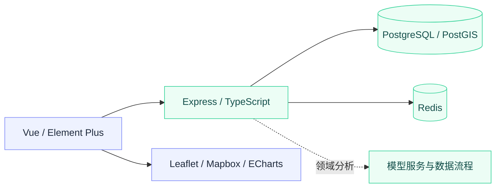

<div align="center">

# Disaster Risk System

灾害风险管理系统 · 地理空间数据、风险分析与可视化。


[项目定位](#项目定位) · [快速开始](#快速开始) · [技术架构](#技术架构) · [工程验证](#工程验证)

</div>

这是 `alanbulan/BS` 中的灾害风险管理领域实践。主工程位于 `disaster-risk-system/`，包括 Express 后端与 Vue Web 前端，并保留数据、模型及相关项目资料。仓库名继续使用 `BS`，避免改变已有克隆和引用地址。

## 项目定位

| 领域 | 内容 |
| --- | --- |
| 空间数据 | 风险区域、地图可视化与地理空间数据管理 |
| 监测与评估 | 监测数据、风险分析与评估模型相关流程 |
| 应急业务 | 预警、应急响应、疏散与避难场所相关设计 |

保留为 GIS 与业务系统作品，不作为现实灾害预警或应急决策的唯一依据。原有规划中的移动端和模型能力，需要结合对应模块与运行记录逐项核验，不能由根 README 推断全部可交付。

## 快速开始

### 环境

前端 [package.json](./disaster-risk-system/frontend-web/disaster-risk-frontend/package.json) 明确声明 Node.js `^20.19.0 || >=22.12.0`。不再沿用旧 README 中的 Node.js 16 起步说明。数据库和缓存配置使用 PostgreSQL / PostGIS、Redis；模型服务依赖以其实际 requirements 和文档为准。

```sh
git clone https://github.com/alanbulan/BS.git
cd BS
```

先为本机配置独立的开发数据库及缓存，核对环境变量、数据初始化脚本与端口。禁止将真实数据库凭据、个人数据或地图服务密钥提交到 Git。执行数据库脚本前备份已有数据。

### 后端

```sh
cd disaster-risk-system/backend
npm install
npm run dev
```

### Web 前端

另开一个终端，从仓库根目录进入：

```sh
cd disaster-risk-system/frontend-web/disaster-risk-frontend
npm install
npm run dev
```

浏览器地址以 Vite 输出为准；后端端口、数据库连接和前端 API 配置必须对应。需要模型服务时，再根据该模块的实际依赖与启动说明启动，不把单独打开前端当成全系统启动完成。

## 技术架构



| 层级 | 当前配置与入口 |
| --- | --- |
| 后端 | [backend](./disaster-risk-system/backend)：Express、TypeScript、pg、Redis、Winston、Jest |
| Web 界面 | [frontend-web](./disaster-risk-system/frontend-web)：Vue 3、Pinia、Element Plus、Vite 7、地图与图表组件 |
| 工程资料 | [disaster-risk-system](./disaster-risk-system)：按实际目录查看数据库、模型和项目文档 |

依赖版本以各模块 manifest 与锁文件为准。此图表达项目结构，不表示所有数据链路已完成生产验收。

## 工程验证

| 模块 | 命令 | 说明 |
| --- | --- | --- |
| 后端 | `npm run lint` | ESLint 静态检查 |
| 后端 | `npm test` | Jest 测试入口 |
| 后端 | `npm run build` | TypeScript 编译 |
| 前端 | `npm run build` | 当前脚本仅执行 `vite build`，不是独立类型检查或浏览器回归 |

本次仅更新文档，没有执行构建、模型评估、真实数据联调、移动端安装或应急业务验收。工程记录应注明时间、环境、输入数据和适用范围。

## 许可证与反馈

保留原有 MIT License 声明，后端 manifest 同样标注 MIT；本次不修改授权条款。问题请通过 [Issues](https://github.com/alanbulan/BS/issues) 提交，并去除凭据和个人信息。
